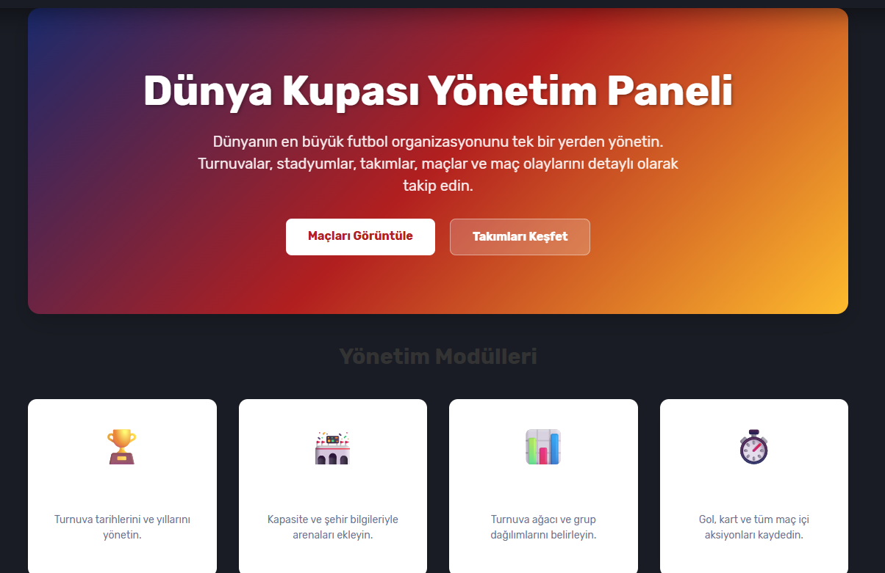
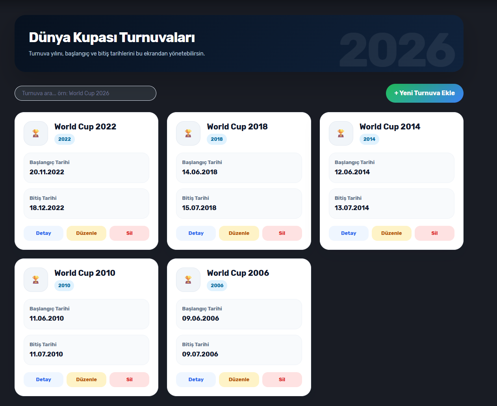
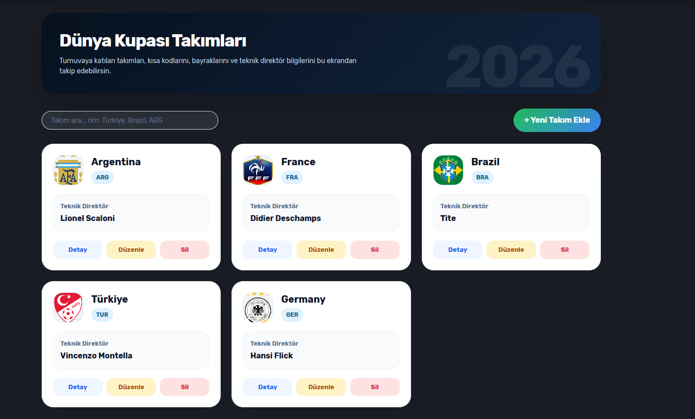
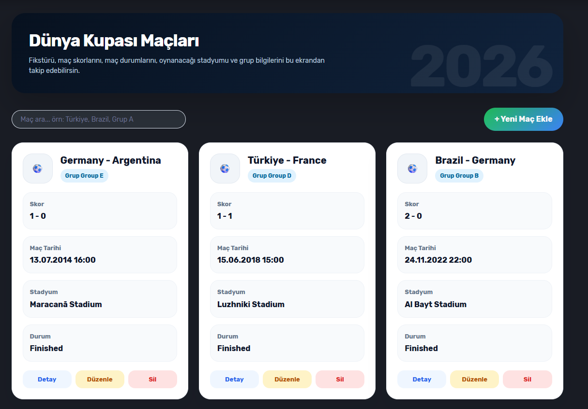
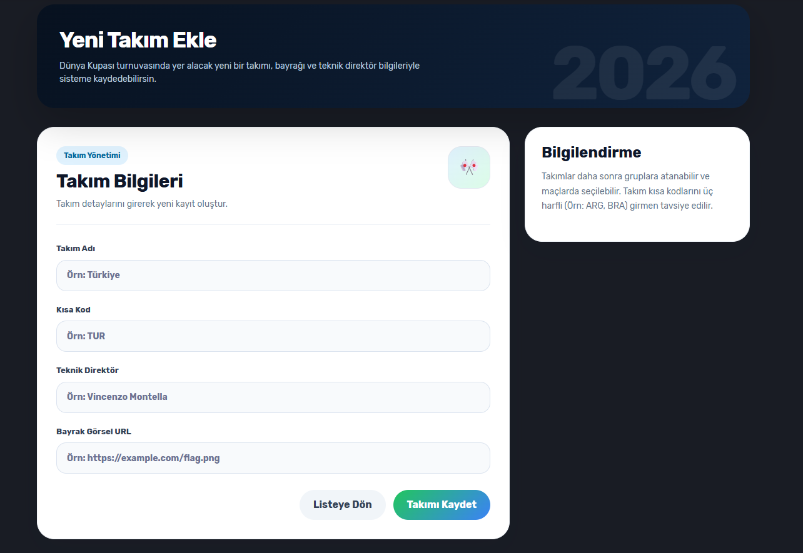
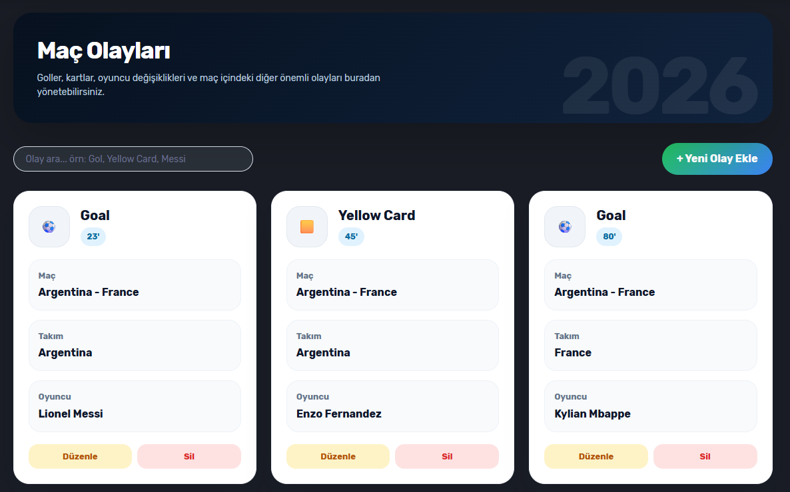
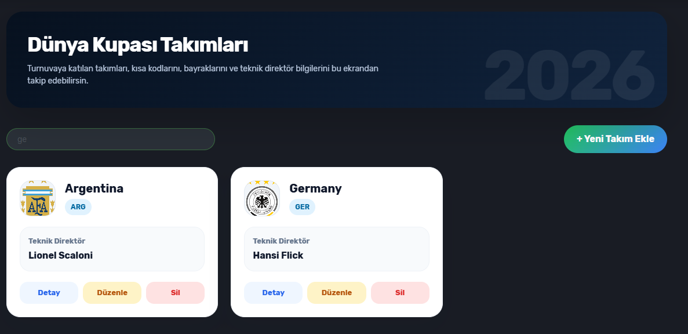

# Project.World.Cup

Bu proje, Dünya Kupası (World Cup) süreçlerini yönetmek, verilerini işlemek ve kullanıcıya sunmak amacıyla geliştirilmiş çok katmanlı (N-Tier) bir .NET uygulamasıdır.

## Mimari ve Katmanlar

Proje genel hatlarıyla üç ana katmandan oluşmaktadır:

*   **Project.World.Cup.Model**: Projede kullanılan temel veri modellerinin (Entity/DTO) ve iş nesnelerinin bulunduğu katmandır.
*   **Project.World.Cup.Data**: Veritabanı işlemleri, veri erişim katmanı (Data Access) ve repository'lerin bulunduğu bölümdür. Dış kaynaklarla veya veritabanıyla olan etkileşimler buradan yönetilir.
*   **Project.World.Cup.UI**: Kullanıcı arayüzü (User Interface) projelerini içerir. Kullanıcının sistemle etkileşime girdiği ekranlar, view'lar ve controller/ViewModel yapıları bu katmanda yer alır.

## Kurulum ve Başlangıç

1.  Projeyi yerel bilgisayarınıza klonlayın.
2.  Visual Studio veya tercih ettiğiniz IDE ile `Project.World.Cup.slnx` dosyasını açın.
3.  Eğer veritabanı kullanılıyorsa, `Data` katmanındaki bağlantı dizelerini (connection string) kendi ortamınıza göre güncelleyin.
4.  Gerekli NuGet paketlerinin geri yüklendiğinden (Restore) emin olun.
5.  `Project.World.Cup.UI` projesini Başlangıç Projesi (Startup Project) olarak ayarlayıp çalıştırın.

## Kullanılan Teknolojiler

*   C# & .NET
*   (Buraya kullanılan veritabanı teknolojisi örn. Entity Framework Core, SQL Server eklenebilir)
*   (Buraya kullanılan UI teknolojisi örn. WPF, WinForms, ASP.NET Core eklenebilir)

*   ## 📸 Ekran Görüntüleri (Screenshots)

Dünya Kupası yönetim sisteminin arayüzüne ve işlevlerine ait ekran görüntülerine aşağıdan ulaşabilirsiniz:

### 🌍 Ana Sayfa (Genel Bakış)

---

### 🏆 Turnuva ve Karşılaşma Listeleri
Sistemde yer alan turnuvaların, takımların ve eşleşmelerin görüntülendiği temel listeleme ekranları:

<table width="100%">
  <tr>
    <td width="33%" align="center">
      <strong>Turnuvalar</strong> 
      
    </td>
    <td width="33%" align="center">
      <strong>Takımlar</strong> 
      
    </td>
    <td width="33%" align="center">
      <strong>Maçlar</strong> 
      
    </td>
  </tr>
</table>

---

### ⚙️ İşlemler ve Detay Ekranları
Yeni kayıt oluşturma, detaylı inceleme ve sistem içi dinamik arama ekranları:

<table width="100%">
  <tr>
    <td width="33%" align="center">
      <strong>Yeni Takım Ekle</strong> 
      
    </td>
    <td width="33%" align="center">
      <strong>Maç Detayları</strong> 
      
    </td>
    <td width="33%" align="center">
      <strong>Dinamik Arama</strong> 
      
    </td>
  </tr>
</table>
